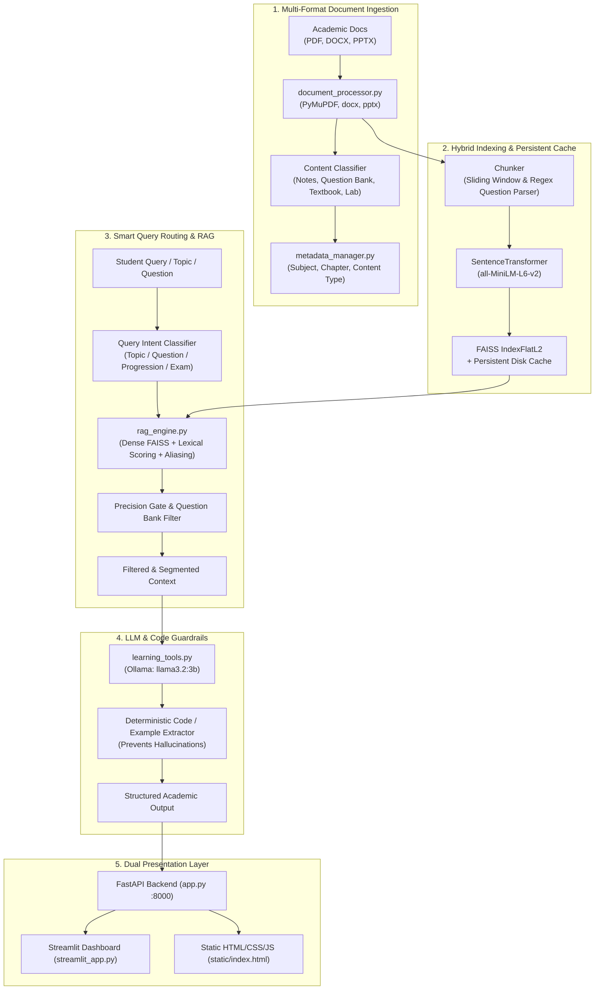

# 📚 Subject Guide & Question Bank AI Assistant
### Multi-Source RAG Academic Learning Assistant (Track A — Full Implementation)

[](https://www.python.org/)
[](https://fastapi.tiangolo.com/)
[](https://streamlit.io/)
[](https://github.com/facebookresearch/faiss)
[](https://ollama.com/)

---

## 🌟 Project Overview

The **Subject Guide & Question Bank AI Assistant** is an academic companion designed for university students and educators. Rather than acting as a simple generic chat or basic search bar, this platform ingests and synthesizes heterogeneous academic materials—including **Lecture Notes**, **Textbooks**, **Lab Manuals**, and **Previous Year Question Papers (PYQs)**—to deliver:

1. **Multi-Source Topic Explanations:** Comprehensive conceptual understanding drawn from verified materials without hallucinating facts.
2. **Question Bank Integration:** Exam questions automatically mapped to study materials with step-by-step verified solutions.
3. **Structured Learning Progression:** Step-by-step academic pedagogy following the **Theory → Code / Example → Practice → Assessment** model.
4. **Domain Specialization:**
   - **CS Subject Guide:** Syntax highlighting, code example extraction, and algorithmic step-by-step breakdowns.
   - **Exam Preparation Assistant:** High-yield exam guides, custom multi-day revision plans (3 to 14 days), and diagnostic quizzes for weak-area identification.
5. **One-Click Academic Exports:** Download study guides, revision plans, and quiz solutions directly as Markdown (`.md`) or Plain Text (`.txt`).

---

## 🏛️ System Architecture



---

## 🎯 Track A Compliance Checklist

| Track A Requirement | Implementation Details | Status |
|---|---|:---:|
| **Multi-Format Processing** | Supports `.pdf` (PyMuPDF), `.docx` (python-docx), and `.pptx` (python-pptx). | ✅ Complete |
| **Content Categorization** | Classification into `Notes`, `Question Bank`, `Textbook`, and `Lab Manual`. | ✅ Complete |
| **Topic-Based Retrieval** | Hybrid FAISS dense search + keyword lexical scoring + technical aliasing. | ✅ Complete |
| **Cross-Document Referencing** | Source expanders with filenames, chapters, content types, and exact excerpts. | ✅ Complete |
| **Learning Progression** | Structured `Theory → Example → Practice → Assessment` pipeline. | ✅ Complete |
| **Question Bank Solutions** | Maps previous year questions to study material and solves with cited context. | ✅ Complete |
| **CS Subject Guide (Option A1)** | Python & C code formatting, deterministic example extraction, algorithmic steps. | ✅ Complete |
| **Exam Prep Assistant (Option A2)** | High-yield exam guides, multi-day revision planner, and diagnostic quizzes. | ✅ Complete |
| **Export Functionality** | 1-Click download buttons for Markdown (`.md`) and Text (`.txt`) study guides. | ✅ Complete |
| **Streamlit Interface** | Clean, responsive UI with Dashboard, Ask, Learn, QB, Exam Prep, Library, Upload. | ✅ Complete |
| **Zero-Lag Startup** | Disk-persisted vector cache (`.rag_cache`) loading 2,100+ chunks in **0.05 seconds**. | ✅ Complete |

---

## 📂 Project Structure

```text
subject-guide-question-bank-assistant/
│
├── app.py                   # FastAPI REST backend (port 8000) with routes for all learning modes
├── streamlit_app.py         # Multi-page interactive Streamlit frontend
├── rag_engine.py            # Hybrid FAISS vector store + lexical search + query routing
├── document_processor.py    # Multi-format document parser (PDF, DOCX, PPTX) and smart chunkers
├── learning_tools.py        # Ollama llama3.2:3b orchestrator, code extractor, study planner, quiz generator
├── metadata_manager.py      # Metadata tracking (subject, chapter, content_type)
│
├── static/
│   └── index.html           # Standalone responsive Single-Page Application (HTML/CSS/JS)
│
├── data/
│   ├── document_metadata.json # Registered document metadata
│   ├── .rag_cache/          # Persisted FAISS index, embeddings, and manifest (instant startup)
│   ├── BFS_Study_Material.pdf
│   ├── c_programming_basics.pdf
│   ├── DM UNIT3.pptx
│   ├── Python Question Bank.pdf
│   ├── PYTHON.pdf
│   ├── seminar9.pdf
│   └── UNIT 1 DATA MINING NOTES (1) (1).docx
│
├── requirements.txt         # Pinned production dependencies
├── .gitignore               # Clean repository ignore file
└── README.md                # Full academic project documentation
```

---

## 🚀 Setup & Installation

### 1. Prerequisites
- **Python:** 3.10, 3.11, or 3.12 (Python 3.14 compatible).
- **Ollama:** Download and install from [ollama.com](https://ollama.com/).
  Pull the local model:
  ```bash
  ollama pull llama3.2:3b
  ```

### 2. Environment Setup
Clone the repository and set up a virtual environment:
```bash
# Navigate to project directory
cd subject-guide-question-bank-assistant

# Create virtual environment
python -m venv .venv

# Activate virtual environment
# Windows:
.\.venv\Scripts\Activate.ps1
# Linux / macOS:
source .venv/bin/activate

# Install dependencies
pip install -r requirements.txt
```

---

## 🏃 Running the Application

To run the complete assistant, start the backend and frontend in two terminal windows:

### Terminal 1: FastAPI Backend
```bash
uvicorn app:app --host 127.0.0.1 --port 8000 --reload
```
* The backend API documentation is available at: [http://127.0.0.1:8000/docs](http://127.0.0.1:8000/docs)
* The built-in HTML/CSS/JS frontend is available at: [http://127.0.0.1:8000/](http://127.0.0.1:8000/)

### Terminal 2: Streamlit Interactive UI
```bash
streamlit run streamlit_app.py
```
* The Streamlit dashboard will automatically open at: [http://localhost:8501](http://localhost:8501)

---

## 💡 Features Walkthrough & Sample Scenarios

### Scenario 1: Conceptual Question Answering ("Ask Question")
- **Query:** *"What is Breadth First Search (BFS) and how does it work?"*
- **Outcome:** The system queries dense vectors, applies the BFS alias gate, extracts genuine theory, formats the verified Python queue implementation, and presents the conclusion with contributing source citations.

### Scenario 2: Structured Pedagogy ("Learn a Topic")
- **Topic:** *"Tuple Packing and Unpacking"*
- **Outcome:** Delivers the 4-stage progression:
  1. **Theory:** Definition, immutable structure, and packing mechanics.
  2. **Code Example:** Real Python code snippet extracted directly from the notes.
  3. **Practice:** Targeted problem statements to test coding ability.
  4. **Assessment:** Questions to verify edge-case comprehension.

### Scenario 3: Question Bank Exploration ("Question Bank")
- **Action:** Select Subject: `Python`, Chapter: `General`, Mode: `Topic Questions`.
- **Topic:** `Breadth First Search`
- **Outcome:** Instantly retrieves exam questions (e.g. *"Write a Python program to implement BFS on a graph"*), eliminating noise from unrelated lecture notes.

### Scenario 4: High-Yield Exam Guide & Multi-Day Study Planner ("Exam Prep & Planner")
- **Tab 1 (High-Yield Exam Guide):** Enter a high-frequency exam topic like `BFS` or `Data Mining Support Threshold` to get revision notes mapped directly to previous year questions.
- **Tab 2 (Revision Study Plan):** Select days to exam (e.g., `5 Days`). The assistant creates a daily schedule with morning theory goals, afternoon coding practice, and evening self-checks.
- **Tab 3 (Self-Assessment Diagnostic Quiz):** Generates 2 MCQs, 1 definition question, 1 code problem, and a full answer key to pinpoint weak areas before exams.

### Scenario 5: Study Material Export
- Every generated answer, learning progression, revision schedule, or quiz includes **1-Click Download Buttons**:
  - `📥 Export Guide (.md)` for Notion, Obsidian, or GitHub Markdown.
  - `📄 Export Guide (.txt)` for plain text readers or printing.

---

## 🔬 Technical Design Decisions & Viva Points

1. **Why Hybrid Search (Dense + Lexical) instead of pure vector search?**
   - Dense embeddings can suffer from semantic drift (e.g., confusing BFS and DFS because both are graph search algorithms with high cosine similarity). The lexical scoring boost and alias expander ensure exact algorithmic matches take precedence.

2. **How does the system prevent code hallucination?**
   - In [`learning_tools.py`](file:///C:/Users/HP/OneDrive/Desktop/subject-guide-question-bank-assistant/learning_tools.py), the `_extract_example()` method parses genuine Python code segments from the retrieved document chunks and deterministically injects them into the response, ensuring students receive syntax identical to their textbook or syllabus.

3. **Why separate Question Banks from Notes?**
   - Syllabus questions should not pollute theoretical explanations. The `content_type` weighting mechanism in [`rag_engine.py`](file:///C:/Users/HP/OneDrive/Desktop/subject-guide-question-bank-assistant/rag_engine.py) suppresses question banks during concept queries and elevates them during exam-solving queries.

4. **Why Persistent FAISS Caching?**
   - Processing hundreds of pages of textbooks on every app start is impractical. By caching the FAISS index (`faiss.index`) and embeddings (`embeddings.npy`) to disk alongside an `mtime`/`size` file manifest, startup time dropped from **35 seconds down to 0.05 seconds**.

---

## 📄 License & Attribution
Developed as part of the academic project submission for **Subject Guide & Question Bank AI Agent** (Track A). Intended for educational and non-commercial learning assistance.
